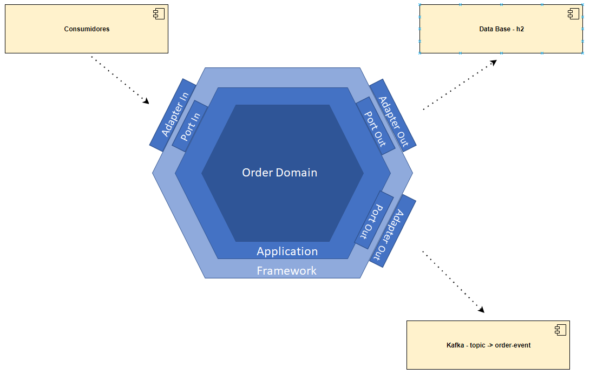
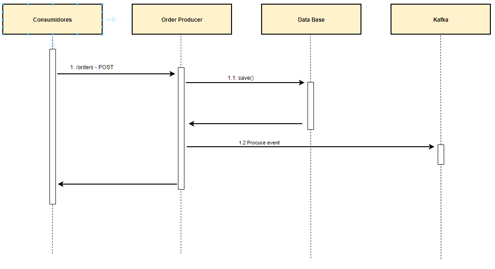
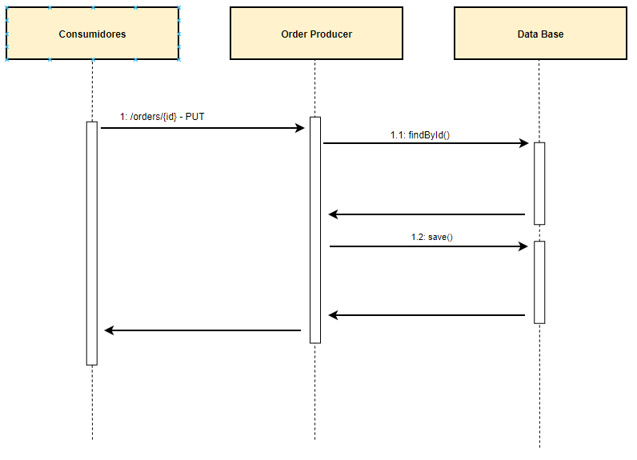
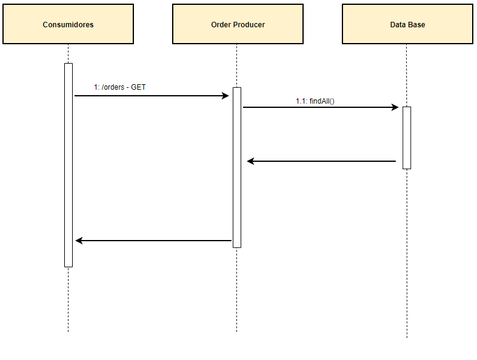
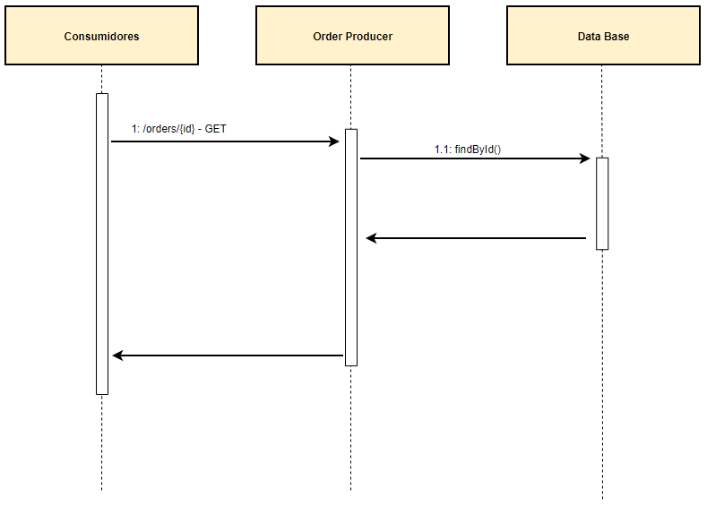
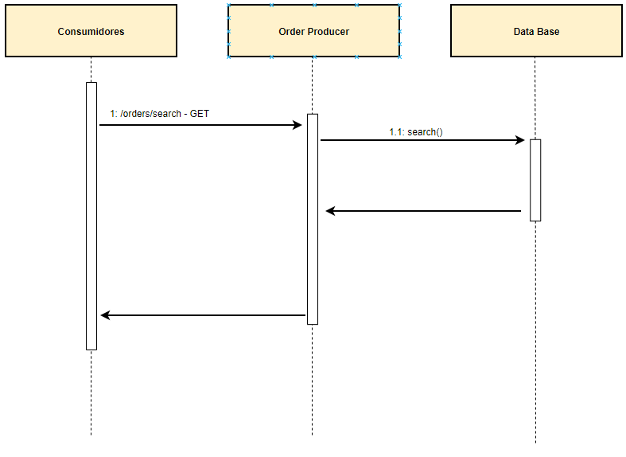
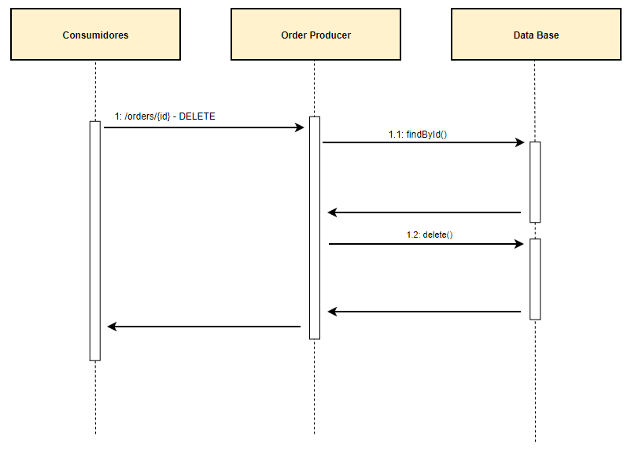

### **HISTÓRICO DE ELABORAÇÃO**
| **Data**     | **Versão**   | **Autor**                      | **Descrição da Alteração** |
|:------------:|:------------:|:------------------------------:|:--------------------------:|
| _23/12/2021_ | _01_         | _eduardo.navas@telefonica.com_  | _Criação do documento_   
---

### **1 Contexto**
Avaliação fast-track spring boot

### **2 Escopo**
MicroServiço responsavél pelo crud do objeto Order e geração de evento no topico kafka .

### **3 Componentes**

### **4. Documentos**
#### 4.1 Swagger
> [swagger.json](src/main/resources/static/documents/swagger.json)

A pagina do swagger esta exposta no link http://localhost:9999/swagger.html

#### 4.2 Collection
> [Collection-Postman.json](src/main/resources/static/documents/Fast_Track_Spring_boot.postman_collection.json)

### 5 Operações
#### 5.1 Save
Salvar uma nova order

##### 5.1.1 URL da operação
> /orders
**Method:** POST

##### 5.1.2 Request

Para vizualizar o request consultar o swagger no operação POST - /orders

##### 5.1.3 Response

Para vizualizar o response consultar o swagger no operação POST - /orders

#### 5.2 Update
Atualizar uma order existente

##### 5.2.1 URL da operação
> /orders/{id}
**Method:** PUT

##### 5.2.2 Request

Para vizualizar o request consultar o swagger no operação PUT - /orders/{id}

##### 5.2.3 Response

Para vizualizar o response consultar o swagger no operação PUT - /orders/{id}

#### 5.3 Find all
Buscar todas as orders cadastradas

##### 5.3.1 URL da operação
> /orders
**Method:** GET

##### 5.3.2 Request

Para vizualizar o request consultar o swagger no operação GET - /orders

##### 5.3.3 Response

Para vizualizar o response consultar o swagger no operação GET - /orders

#### 5.4 Find by id
Buscar uma order por id

##### 5.4.1 URL da operação
> /orders/{id}
**Method:** GET

##### 5.4.2 Request

Para vizualizar o request consultar o swagger no operação GET - /orders/{id}

##### 5.4.3 Response

Para vizualizar o response consultar o swagger no operação GET - /orders/{id}

#### 5.5 Search
Busca orders que atendem aos seguintes requisitos:

 - o total ser maior ou igual ao valor do min_total
 - o total ser menor ou igual ao valor do max_total
 - o status do order ser igual ao valor do parametro de entrada status
 - o nome ou a descrição serem iguais ao vamor do paramtro q 

##### 5.5.1 URL da operação
> /orders/search?max_total=""&min_total=""&status=""&q=""
**Method:** GET

##### 5.5.2 Request

Para vizualizar o request consultar o swagger no operação GET - /orders/search

##### 5.5.3 Response

Para vizualizar o response consultar o swagger no operação GET - /orders/search

#### 5.6 Detele
Deleta orders com base no id:

##### 5.6.1 URL da operação
> /orders/{id}
**Method:** DELETE

##### 5.6.2 Request

Para vizualizar o request consultar o swagger no operação GET - /orders/{id}

##### 5.6.3 Response

Para vizualizar o response consultar o swagger no operação GET - /orders{id}

### **6. Adapters**

#### 6.1.  Banco de dados H2
O banco de dados h2 esta configurado no application.yml. Na configuração spring.datasource.url é especificada a pasta onde o h2 armazenara os dados.

#### 6.2.  Kafka
Todas as configurações do kafka estão no application.yml.
